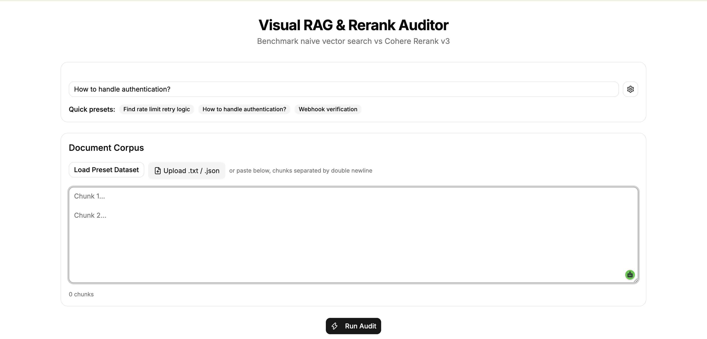

# Visual RAG & Rerank Auditor

Side-by-side benchmarking tool that compares naive vector search against Cohere Rerank v3 on a set of document chunks.  
Displays rank movement, relevance scores, and latency breakdown, so developers can see exactly how cross-encoder reranking changes retrieval results.

## Demo


*Side‑by‑side dashboard after auditing a preset query.*

---


*Full flow: query input → audit run → results with rank shifts.*

## What it does

- Accepts a query and a document corpus (custom text, `.txt`/`.json` upload, or pre-loaded technical dataset).
- Runs two retrieval paths in parallel:
  - **Naive Dense Search** – embeds query and documents with `cohere.embed` (`embed-english-v3.0`), computes cosine similarity, ranks by score.
  - **Cohere Rerank** – sends raw texts to `cohere.rerank` (`rerank-v3.5`) and returns cross-encoder relevance scores.
- Renders a split‑screen dashboard:
  - Left column: top‑5 chunks from naive search.
  - Right column: top‑5 from reranking, with rank‑shift badges (e.g., ▲ +3, ▼ -2).
  - Each chunk shows a progress bar for its normalized score.
- Exposes latency metrics: embedding time, rerank time, total, and top‑1 reciprocal rank change indicator.

## Why it exists

Vector similarity frequently misses the most relevant chunk because of lexical mismatches or domain shift. Reranking fixes that, but there are few lightweight, visual tools that show the exact impact on a custom corpus. This application fills that gap.

## Tech Stack

- **Frontend**: Next.js 14 (App Router), TypeScript, Tailwind CSS, shadcn/ui, Framer Motion
- **Backend**: Next.js API route (`/api/audit`) using the official `cohere-ai` SDK
- **Math**: Custom cosine similarity (no extra library)
- **Deployment**: Vercel (single command build)

## Getting Started

### Prerequisites

- Node.js ≥ 18
- A Cohere API key ([get one here](https://dashboard.cohere.com/api-keys))

### Installation

```bash
git clone https://github.com/yourusername/rag-auditor.git
cd rag-auditor
npm install
```

Set your key (optional – you can also provide it in the browser):
```bash
echo "COHERE_API_KEY=your_key" > .env.local
```

Start the development server:
```bash
npm run dev
```

Open http://localhost:3000

###  Using without a server key
If COHERE_API_KEY is not set, the app will prompt you for your own key. It stores the key in sessionStorage and sends it with each request. No server‑side key needed.

## Usage
1. Enter a query or pick a preset suggestion.

2. Provide document chunks:
        - Load the built‑in preset corpus.

        - Upload a .txt file (chunks separated by double newline) or a .json array of strings.

        - Paste chunks directly into the text area (double newline separated).

3. Click Run Audit.

4. Inspect the side‑by‑side results and the latency breakdown.

## Preset Corpus
The included preset contains 12 technical documentation snippets (Stripe‑like API docs) that demonstrate lexical mismatch — ideal for showing how re-rank recovers the correct chunk.

## Project Structure

```
src/
├── app/
│   ├── api/audit/route.ts      # POST endpoint: embed + cosine, rerank, rank movement
│   ├── layout.tsx               # Root layout with meta tags
│   └── page.tsx                 # Entry point
├── components/
│   ├── auditor.tsx              # Main interactive client component
│   ├── rank-badge.tsx           # ▲/▼ badges
│   └── result-card.tsx          # Single chunk row with score bar
├── data/
│   └── presets.ts               # Built‑in corpus
├── lib/
│   └── math.ts                  # cosineSimilarity()
```

The API route does the heavy lifting: cohere.embed (with inputType: 'search_query' and 'search_document'), cosine similarity ranking, and cohere.rerank. It returns top‑5 lists, rank deltas, and timing info.

## Example Output

```json
{
  "naiveResults": [
    { "index": 2, "score": 0.82 },
    ...
  ],
  "rerankResults": [
    { "index": 5, "score": 0.96 },
    ...
  ],
  "rankMovement": [
    { "index": 5, "oldRank": 4, "newRank": 1, "delta": 3 },
    ...
  ],
  "metrics": {
    "embedLatencyMs": 120,
    "rerankLatencyMs": 140,
    "totalLatencyMs": 260,
    "top1ReciprocalRankDelta": "Top‑1 changed from doc 2 → 5"
  }
}
```